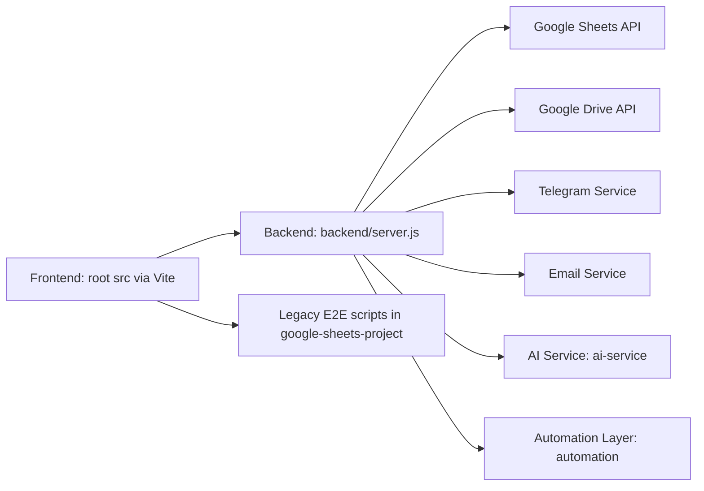

# Repository Structure, Flow, and Function Update

Updated: 2026-03-14
Scope: Full workspace audit for structure, duplicated projects/folders, execution flow, and documentation alignment.

## 1. Executive Summary

Current repository is runnable, but contains multiple parallel project roots and duplicated utility folders.

Key findings:

- 3 Node project roots:
  - package.json (root, main app)
  - backend/package.json (API server)
  - google-sheets-project/package.json (legacy/sub-app)
- 3 Python project roots:
  - ai-service/requirements.txt
  - automation/requirements.txt
  - automation/one_automation_system/requirements.txt
- scripts vs src/scripts overlap:
  - 21 duplicated file paths
  - 19 root-only files
  - 19 src-only files
- Top-level empty or stale folders:
  - mia-logistics-manager
  - mia-logistics-manager-122
  - React-OAS-Integration-v4.0
  - exports

Conclusion:

- Main operational stack should stay centered at root + backend + ai-service + automation.
- google-sheets-project should be treated as legacy/support package, not primary app.
- scripts should be canonical; src/scripts should be reduced or archived.

## 2. Current Runtime Structure (As-Is)

### 2.1 Primary stack (recommended active)

- Frontend app: src + Vite via root package.json
- Backend API: backend/server.js
- AI service: ai-service (FastAPI stack)
- Automation service: automation (Python automation + tests)
- DevOps scripts: scripts

### 2.2 Secondary/legacy stack

- google-sheets-project (contains separate React + Node setup)
- Note: still referenced by root test:e2e script

### 2.3 Utility/asset folders

- docs
- GUIDE
- public
- data
- logs
- certs
- backups

## 3. Duplicate and Overlap Analysis

### 3.1 scripts and src/scripts duplication

Duplicated file paths (21):

- analyze-bundle-deps.js
- analyze-bundle.js
- build-optimize.js
- check/health.sh
- create-env-from-json.js
- deploy.js
- deploy/main.sh
- health-check.js
- performance-bundle.js
- save-webpack-stats.js
- setup/main.sh
- start/all.sh
- stop/all.sh
- test-wrapper.sh
- testEmailService.js
- testGoogleConnection.js
- testTelegramConnection.js
- uptime-monitor.js
- utils/clean.sh
- utils/common.sh
- utils/ports.sh

Impact:

- High confusion risk for maintenance and CI onboarding.
- Increased probability of hotfix being applied to wrong file.

Recommendation:

- Keep scripts as single source of truth.
- Mark src/scripts as legacy and migrate unique files intentionally.

### 3.2 automation and automation/one_automation_system overlap

Both contain independent Python dependency stacks and automation entry files.

Signals of overlap:

- Duplicate requirements files style and scope.
- Similar naming patterns: automation.py, bridge flows, setup files.
- one_automation_system appears to be a packaged/legacy branch under active automation.

Recommendation:

- Keep automation as canonical runtime.
- Move one_automation_system into a legacy namespace or archive once dependency is confirmed unused.

### 3.3 Legacy subproject overlap

- google-sheets-project has its own package.json and app stack, while root already runs full platform.
- Root still depends on one path in this folder for E2E test script.

Recommendation:

- Keep for now due to test:e2e dependency.
- Classify as legacy-in-use until E2E scripts are migrated.

## 4. Functional Map by Folder

### 4.1 Root application layer

- src: frontend modules, routes, services, state management, UI components.
- scripts: operational tooling (setup, health, deploy, test helpers, start/stop).
- package.json: canonical command entrypoint.

### 4.2 Backend layer

- backend/server.js: Express API, auth, audit, AI routes, sheets/drive routes, health routes, WebSocket init.
- backend/routes: API contract surface.
- backend/services: integration logic and business behaviors.

### 4.3 AI layer

- ai-service/ai_service.py + model files: ML/NLP and predictive service endpoints.
- Deployed/managed as isolated Python service.

### 4.4 Automation layer

- automation: browser/data automation, connectors, test scripts, reporting artifacts.

### 4.5 Legacy/support layer

- google-sheets-project: old standalone app + scripts/tests, still partially referenced.

## 5. System Flow (Current)



Execution commands map:

- Frontend start: npm run start:frontend
- Backend start: npm run start:backend
- Full stack start: npm run start:all
- Integration tests: npm run test:integration
- E2E tests: npm run test:e2e (currently from google-sheets-project)

## 6. Proposed Target Structure (To-Be)

Goal: Remove ambiguity and group by runtime responsibility.

```text
apps/
  frontend/              # current root src + frontend config
  backend/               # current backend
services/
  ai/                    # current ai-service
  automation/            # current automation
ops/
  scripts/               # canonical scripts (from current scripts)
docs/
  architecture/
  deployment/
  guides/
legacy/
  google-sheets-project/ # until e2e migration complete
  one_automation_system/ # if confirmed unused
  old-empty-folders/
```

Note: this is a target plan, not automatically applied in this update.

## 7. Reorganization Plan (Safe Phases)

### Phase 1: Documentation lock (no code move)

- Declare canonical directories:
  - scripts is canonical over src/scripts
  - automation is canonical over automation/one_automation_system
  - root app is canonical over google-sheets-project (except current E2E path)

### Phase 2: Duplicate freeze and redirect

- Add warning headers in src/scripts legacy files.
- Replace internal references to src/scripts with scripts.

### Phase 3: E2E migration

- Copy or rewrite E2E suite from google-sheets-project/scripts/tests to canonical test location.
- Update root test:e2e script accordingly.

### Phase 4: Archive

- Move legacy folders to legacy/ after successful CI validation.
- Remove empty top-level folders.

## 7.1 Execution Status (Applied on 2026-03-14)

The following safe-phase actions were executed in the workspace:

1. Archived empty top-level folders into `legacy/old-empty-folders/`:

- `mia-logistics-manager`
- `mia-logistics-manager-122`
- `React-OAS-Integration-v4.0`
- `exports`

1. Backed up duplicated `src/scripts` files to:

- `legacy/src-scripts-duplicates-backup-2026-03-14/`

1. Replaced 21 duplicated files in `src/scripts` with legacy shims that delegate to canonical files in `scripts`.

- Goal: keep old entry paths working while freezing duplicate drift.
- `src/scripts/utils/common.sh` and `src/scripts/utils/ports.sh` were implemented as source-compatible shims.

## 8. Immediate Cleanup Candidates

Low risk:

- Remove or archive empty folders:
  - mia-logistics-manager
  - mia-logistics-manager-122
  - React-OAS-Integration-v4.0
  - exports

Medium risk (needs reference scan before delete):

- src/scripts duplicated files
- automation/one_automation_system

High risk (defer until migration complete):

- google-sheets-project (because test:e2e depends on it)

## 9. Canonical Source Matrix

| Concern | Canonical Location | Notes |
| --- | --- | --- |
| Frontend app | src | Root Vite flow |
| Backend API | backend | Express + routes/services |
| AI service | ai-service | Python/FastAPI models |
| Automation runtime | automation | Active automation scripts/tests |
| Ops scripts | scripts | Use this as single source |
| Legacy E2E source | google-sheets-project/scripts/tests | Migrate later |

## 10. Documentation Updates Applied

This audit report is the new baseline for structure and flow discussions.

Related docs to keep aligned:

- GUIDE/TESTING.md
- GUIDE/COMPLETE_TEST_GUIDE.md
- TESTING_PROGRESS.md
- TESTING_SUMMARY.md
- docs/README.md

## 11. Next Action Checklist

- [x] Confirm approval to archive empty top-level folders.
- [x] Approve scripts as only canonical ops location.
- [ ] Approve migration of E2E tests out of google-sheets-project.
- [ ] Run CI after this cleanup phase.
